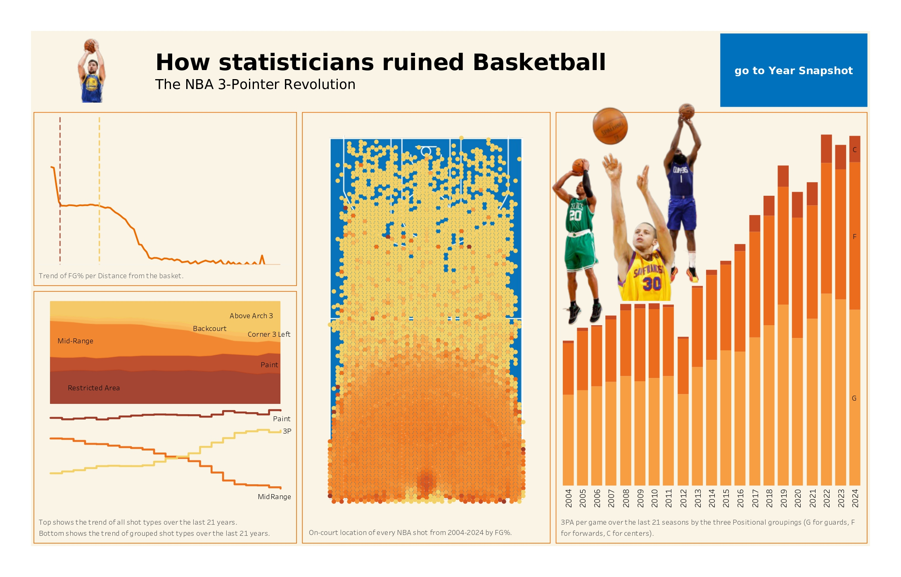
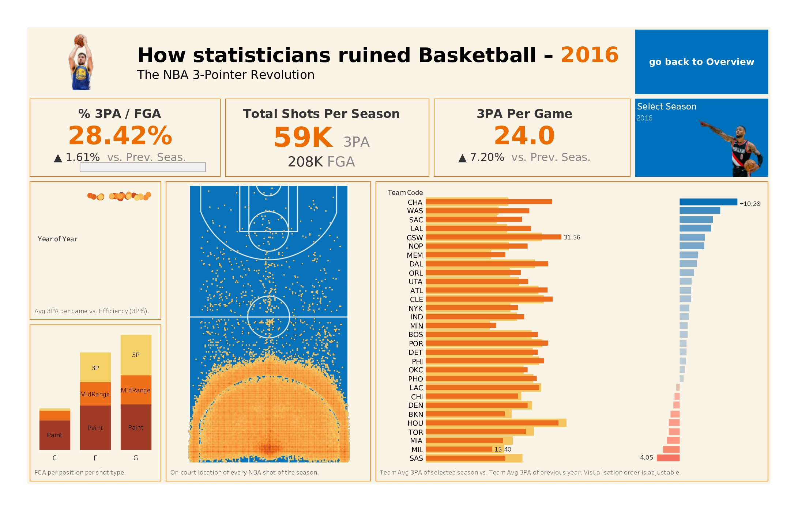
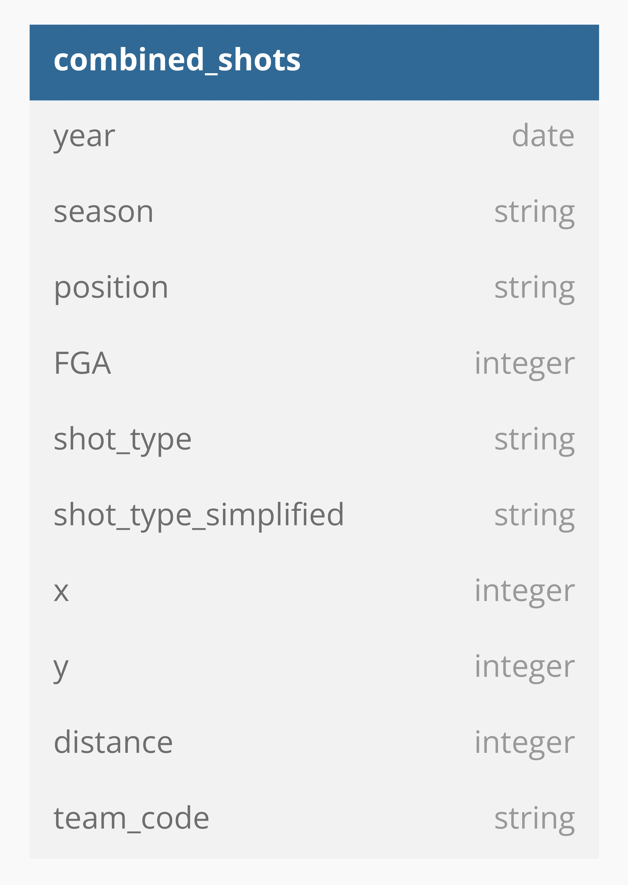

# How Statisticians Ruined Basketball  

  
  &nbsp;&nbsp;&nbsp;
  

## The NBA 3-Pointer Revolution

The rise in 3-point shots over the last two decades is explained by a simple mathematical calculation. 
Consider a prolific shooter:

- A 2-point mid-range jumper typically converts at a 50% rate, yielding an expected return of 1.0 point per attempt (0.5 × 2).
- A 3-point shot, even at a lower 40% accuracy, has an average value of 1.2 points per attempt (0.4 × 3).

This marginal efficiency gain has fundamentally reshaped shot selection, offensive and also defensive strategy across the league. 

This project explores how shot selection has evolved in the NBA over the last 21 seasons, from 2004 to 2024.

## Data Overview

### Data Source
The primary databases for this analysis were shot logs for each NBA season from 2004–2024. They include every shot attempted in official NBA games. They can be found [here](https://www.kaggle.com/datasets/mexwell/nba-shots?resource=download&select=NBA_2005_Shots.csv).

### Initial Data Checks
A first Excel review identified an issue with incorrectly scaled data in 3 of the seasons.

### Data Cleaning & Formatting
Python code used for [correcting wrongly scaled data](https://github.com/stuccopotamus/NBA-shot-evolution/blob/main/python/fixing_wrongly_scaled_data)

Python code used for [cleaning, formatting and grouping](https://github.com/stuccopotamus/NBA-shot-evolution/blob/main/python/format_dataframes)

### Data Structure
The cleaned data was consolidated into a single database with the following structure:

  

### Data Visualisation
Tableau Public was used to carry out visualisations, the final product can be found [here](https://public.tableau.com/app/profile/luca.stucchi/viz/HowstatisticiansruinedBasketball/Overview).

### Data Limitations
- No player-specific data included
- No play-by-play actions
- Lacks seasons prior to 2004, notably missing data from 1979-80, introduction of 3-point line

## Key Questions
This project is based on three central questions:

1. How has 3-point shot selection evolved over the last 20 years?
2. How has mid-range shot selection changed in response?
3. What are the broader consequences of this transformation?

## Key Findings
Following an analytics outburst, the NBA’s 3-point revolution is changing the shape of basketball games.

- In 2003/04, mid-range shots made up 35.65% of total FGAs, but by 2023/24, that dropped to 11.24%
- In contrast, 3-point attempts nearly doubled, from 18.68% to 39.48% of total FGAs
- Teams now average ~35 3PA per game, compared to ~14 two decades ago, in a constant year-over-year increment
- 3-point attempts per player position
  
| Position | 3PA (2004) | 3PA (2024) | % Increase |
|----------|------------|------------|------------|
| Guards   | 9.1        | 17.5       | +93%       |
| Forwards | 5.1        | 14.7       | +187%      |
| Centers  | 0.2        | 2.6        | +1039%     |

> Traditional roles have evolved: whether you are a 6'1" (1.85m) guard or a 7'2" (2.20m) center, you are required to shoot 3s in the modern NBA.
- The role of efficiency:
  - Data shows that 3P% ≈ mid-range FG%
  - Deprioritisation of mid-ranges in favor of 3-point and Restricted Area attempts
    - 3s and paint shots: ~65% of FGA in 2004; >90% of FGA in 2024 

## Recommendations
- Continue tracking 3-point trends adjusting rosters accordingly
- Mid-range shots are increasingly rarer -> defensive focus on perimeter and paint
  - Exploit increasing defensive gaps in the mid-range
- Regardless it is important not to fossilize on a fixed strategy, adaptability and rapid reads are key

> On a microscopic level, basketball is a game of action and reactions. Team strategies should combine shot profiles and have threats from all positions on the court and remain unpredictable.

> On a macroscopic level, teams have to acknowledge the trends and pick talent that fits the current play styles. Similarly developing players have to focus on trainin the more valuable skills for the current time.

## Assumptions and Caveats
- Seasons 2011–12, 2019–20, 2021–22 had fewer games due to lockout and COVID-19 
- Lacking player IDs and advanced play-by-play data

## Summary
This study only provides a snapshot to the last 20 years of NBA, focusing mainly on the shot types.
The 3-point revolution is not looking to slow down soon and statistics are playing a big role in this, reshaping the plays, the players, and tactics of modern basketball. 

For a more comprehensive read on the subject [this article](https://www.nba.com/news/3-point-era-nba-75) inspired the project. 

